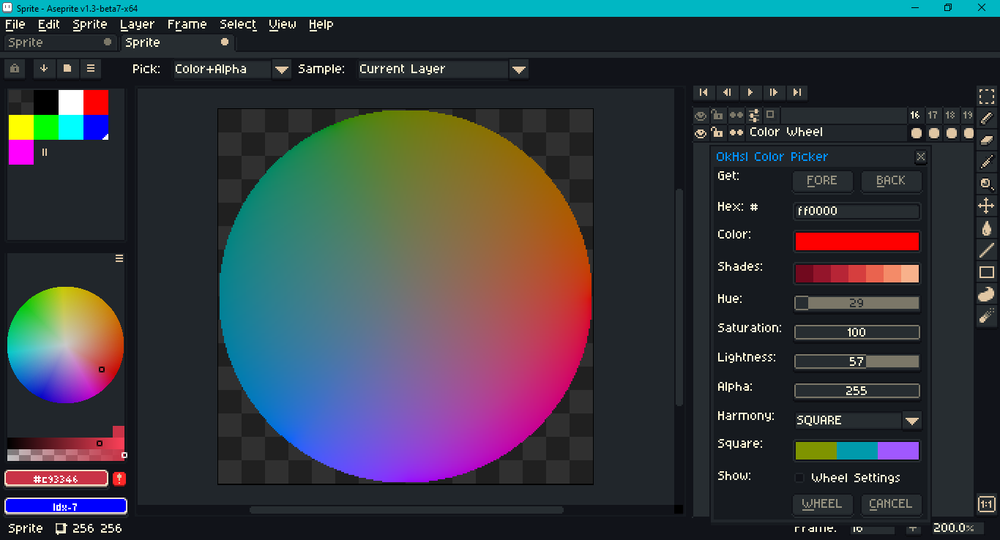

# Okhsl for Aseprite

This is an [Aseprite](https://www.aseprite.org/) dialog that wraps [OKHSL](https://bottosson.github.io/posts/colorpicker/) to provide a color picker and a color wheel generator. Aseprite is an "animated sprite editor & pixel art tool." OKHSL is a color representation developed by Bjorn Ottosson to create an alternative to HSL that is based on human perception. Those interested in an interactive comparison between OKHSL, HSLuv and traditional HSL may reference this [link](https://bottosson.github.io/misc/colorpicker/).

## Installation

To use this script, open Aseprite, go to `File > Scripts > Open Scripts Folder`. Copy and paste the two Lua scripts from this repository into that folder. Return to Aseprite; go to `File > Scripts > Rescan Scripts Folder` (the default hotkey is `F5`). The two scripts should now be listed under `File > Scripts`. Select `ok_picker` to launch the dialog.

To assign a hotkey to the dialog script go to `Edit > Keyboard Shortcuts`.

## Usage

Left click on the color preview window to assign the color to the foreground. Right click to assign to the background. If the alpha channel slider is zero, the color assigned will be transparent black (`0x0` or `Color(0, 0, 0, 0)`).

Hues in OKHSL are not the same as in LCh, HSLuv, or classic HSL. For example, red (`#ff0000`) is at approximately (29, 100, 57) in OKHSL. Do not assume the same primaries, or the same spatial relationships between colors.

When the `Wheel` button is clicked, a new sprite is created. In this sprite, lightness varies with the frame index. Use the arrow keys to navigate through each frame and thus change the lightness. The sprite defaults to the middle frame, so moving left would decrease the lightness; moving right would increase the lightness.

The color wheel's hue is shifted by 30 degrees to match the Aseprite convention.

Click on the `Wheel Settings` toggle to show more parameters. For example, the `Sectors` and `Rings` parameters can be used to make the color wheel discrete in a fashion similar to Aseprite's built-in color wheels.

Supported harmonies are: analogous, complementary, split, square and triadic.

The underlined letters on each button indicate that they work with keyboard shortcuts: `Alt+F` gets the foreground color, `Alt+B` gets the background color, `Alt+C` closes the dialog, `Alt+W` creates a wheel.

This tool -- its harmony and shading features in particular -- is an imperfect aide to artistic judgment, not a replacement for it. See Pixel Parmesan's "[Color Theory for Pixel Artists: It's All Relative](https://pixelparmesan.com/color-theory-for-pixel-artists-its-all-relative/)" on the subject.

_This script was tested in Aseprite version 1.3-beta-7._ It assumes that it will be used in RGB color mode, not indexed or gray mode. Furthermore, it assumes that [sRGB](https://www.wikiwand.com/en/SRGB) (standard RGB) is the sprite's working color space.

To modify this script, see Aseprite's [API Reference](https://github.com/aseprite/api).

## License

This repository uses the MIT License associated with the original implementation in C++ in Ottosson's article.

> Copyright(c) 2021 Bjorn Ottosson
>
> Permission is hereby granted, free of charge, to any person obtaining a copy of
> this softwareand associated documentation files(the "Software"), to deal in
> the Software without restriction, including without limitation the rights to
> use, copy, modify, merge, publish, distribute, sublicense, and /or sell copies
> of the Software, and to permit persons to whom the Software is furnished to do
> so, subject to the following conditions:
>
> The above copyright noticeand this permission notice shall be included in all
> copies or substantial portions of the Software.
>
> THE SOFTWARE IS PROVIDED "AS IS", WITHOUT WARRANTY OF ANY KIND, EXPRESS OR
> IMPLIED, INCLUDING BUT NOT LIMITED TO THE WARRANTIES OF MERCHANTABILITY,
> FITNESS FOR A PARTICULAR PURPOSE AND NONINFRINGEMENT.IN NO EVENT SHALL THE
> AUTHORS OR COPYRIGHT HOLDERS BE LIABLE FOR ANY CLAIM, DAMAGES OR OTHER
> LIABILITY, WHETHER IN AN ACTION OF CONTRACT, TORT OR OTHERWISE, ARISING FROM,
> OUT OF OR IN CONNECTION WITH THE SOFTWARE OR THE USE OR OTHER DEALINGS IN THE
> SOFTWARE.