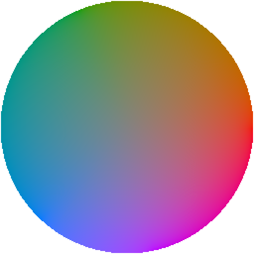
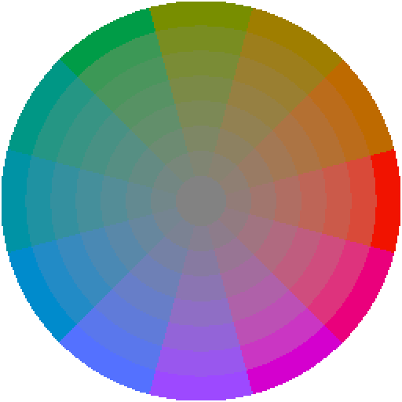

# Okhsv and Okhsl for Aseprite

 

An explanation of the color representation used by this picker can be found in an article written by its creator, Björn Ottosson, "[Okhsv and Okhsl: Two new color spaces for color picking](https://bottosson.github.io/posts/colorpicker/)." Ottosson's source code is shared under the MIT License.