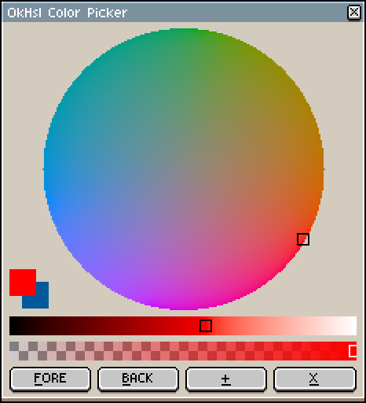
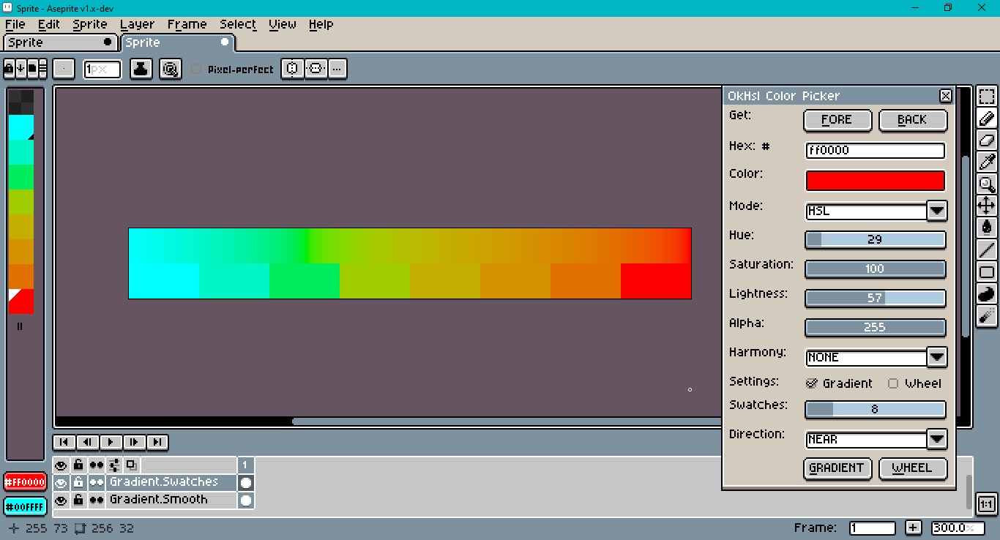
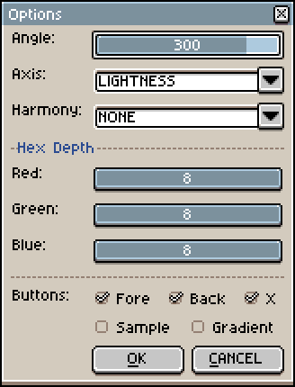
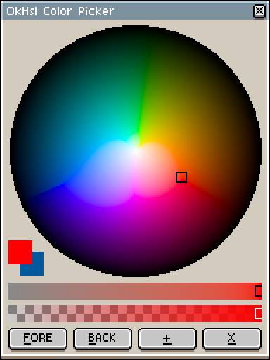
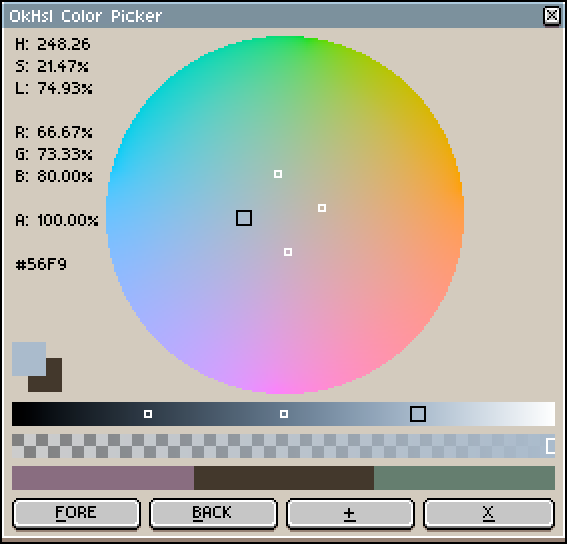
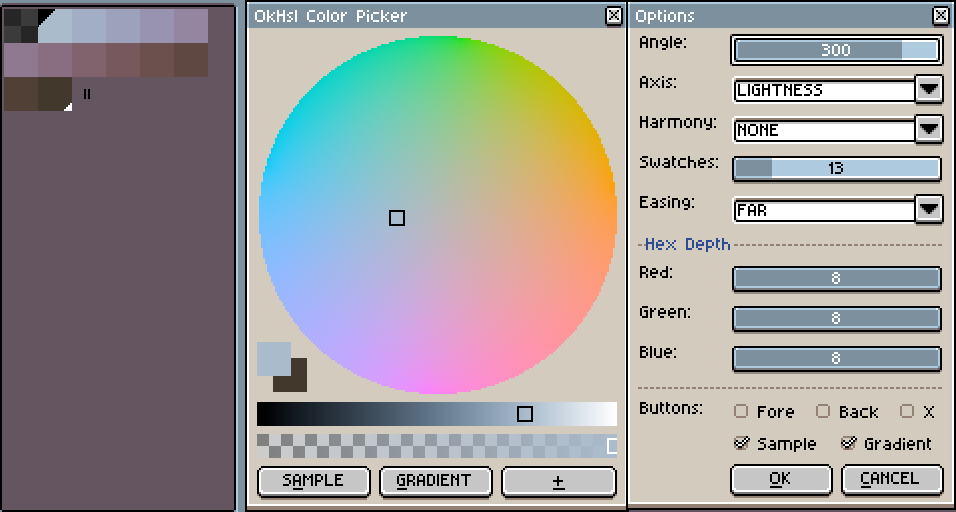
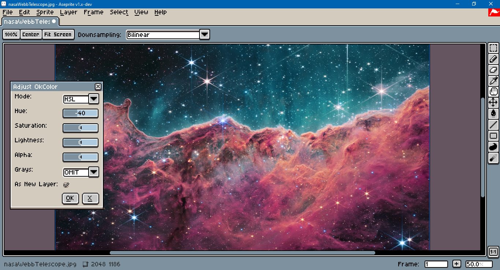
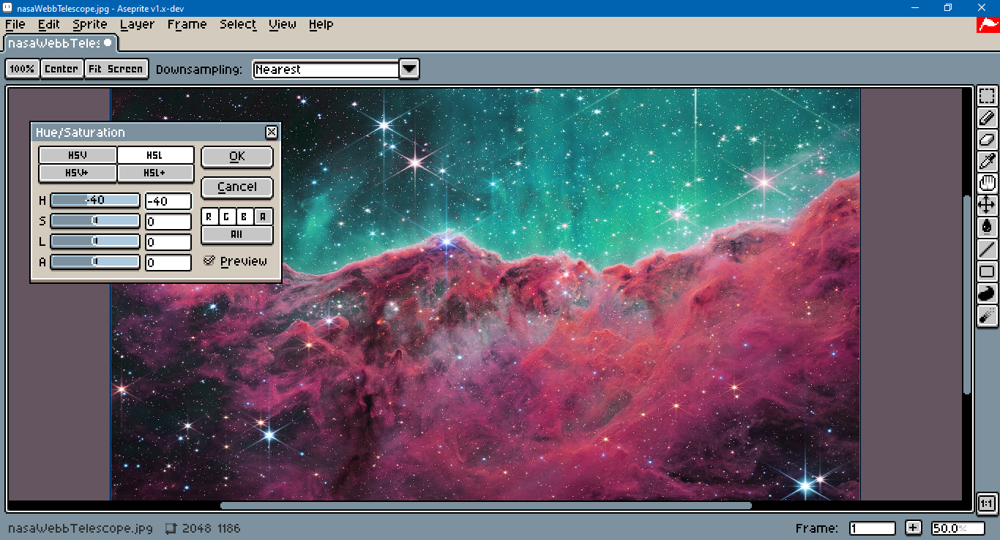
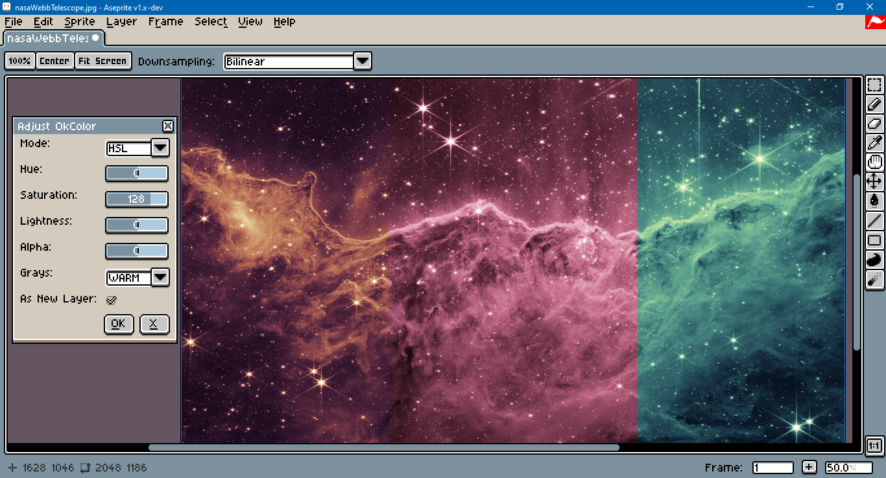

# Okhsl for Aseprite

This is a set of [Aseprite](https://www.aseprite.org/) dialogs that utilize [Okhsl](https://bottosson.github.io/posts/colorpicker/) to provide a color picker and an adjustment filter.

Aseprite is an "animated sprite editor & pixel art tool." Okhsl is a color representation developed by Bjorn Ottosson to create an alternative to HSL that is based on human perception. Those looking for an interactive online comparison between Okhsl, [HSLuv](https://www.hsluv.org/) and traditional HSL should refer to this [article](https://bottosson.github.io/misc/colorpicker/).

[sRGB](https://www.wikiwand.com/en/SRGB) (standard RGB) is the color profile assumed by this script. The sprite's profile can be changed under `Sprite > Properties`. Aseprite's color management settings are under `Edit > Preferences`, in the `Color` section.

_These scripts were tested with Aseprite version 1.3.13-beta1 on Windows 11._

## Installation

To install, open Aseprite, go to `File > Scripts > Open Scripts Folder`. Copy and paste the Lua scripts from this repository into that folder. Return to Aseprite. Go to `File > Scripts > Rescan Scripts Folder` (the default hotkey is `F5`). The scripts should now be listed under `File > Scripts`.

## Usage

Select `ok_picker` or `ok_hue_adj` to launch a dialog. If an error message in Aseprite's console appears, check if the script folder is on a file path that includes characters beyond ASCII, such as 'é' (e acute) or 'ö' (o umlaut). To assign a hotkey to a dialog go to `Edit > Keyboard Shortcuts`. The underlined letters on each dialog button indicate that they work with keyboard shortcuts. For example, `Alt+X` closes the dialog.

When the dialog is wider than it is high, text will be shown to the left of the wheel, including the hue, saturation and lightness. Hues in Okhsl are not the same as in CIE LCH, HSLuv, or traditional HSL. For example, red (`#ff0000`) has a hue of approximately 29 degrees in Okhsl.

Changing the colors in the dialog will change those in Aseprite's color bar. The opposite is not true; colors from the color bar can be retrieved with the `FORE` and `BACK` buttons.

Clicking on the `+` button will open an options menu.

The `Axis` option switches between saturation and lightness as the axis on the bottom slider.

Harmonies will display reticles for analogous, complementary, split, square, tetradic and triadic color harmonies. Left clicking on the harmony bar will set the foreground color. Right clicking will set the background color.

Bit depth will quantize the 8bpp colors in the color bar and change the hexadecimal code display. For example, in the screen shot above, the hex code for RGB555 is shown.

The buttons at the bottom of the dialog can also be changed. In the screen capture above, the gradient button appends to the palette 13 swatch sample from a fore- to background color gradien with furthest hue easing. The sample button samples a color from the sprite canvas at the mouse cursor when `Alt+A` is pressed.

When the dialog wheel canvas has focus, arrow keys will nudge the color. Holding down the `Shift` key while dragging the mouse will pick colors in a discrete amount. Holding down `Ctrl` while dragging the mouse will reset the cursor to a default position at the wheel's center.

To use the older version of the color picker, see `ok_picker_classic.lua`.

## Color Adjustment

A separate dialog allows for cel image adjustment with either `HSV` or `HSL`. `Alt+O` applies the adjustment, `Alt+X` cancels the dialog.

For comparison, below is Aseprite's built-in hue adjustment:

Four colorize options are included for gray colors. `OMIT` excludes grays from saturation. `ZERO` sets the source hue to zero, which is a magenta, not red. `WARM` and `COOL` set the hue to a range between violet and yellow based on the color's lightness in OK LAB. The difference between them is the hue easing direction.

Above, the image was first de-saturated to grayscale. In the re-saturated versions, `WARM` is on the left, `ZERO` is in the center, `COOL` is on the right.

The test image is one of the first images taken by [Nasa's Webb Telescope](https://www.nasa.gov/webbfirstimages/).

## Modification

To modify these scripts, see Aseprite's [API Reference](https://github.com/aseprite/api). A [type definition](https://github.com/behreajj/aseprite-type-definition) for use with VS Code and the [Lua Language Server extension](https://github.com/LuaLS/lua-language-server) is recommended.

🇹🇼 🇺🇦

## License

This repository uses the MIT License associated with the original implementation in C++ in Ottosson's article.

> Copyright(c) 2021 Bjorn Ottosson
>
> Permission is hereby granted, free of charge, to any person obtaining a copy of
> this software and associated documentation files(the "Software"), to deal in
> the Software without restriction, including without limitation the rights to
> use, copy, modify, merge, publish, distribute, sublicense, and/or sell copies
> of the Software, and to permit persons to whom the Software is furnished to do
> so, subject to the following conditions:
>
> The above copyright notice and this permission notice shall be included in all
> copies or substantial portions of the Software.
>
> THE SOFTWARE IS PROVIDED "AS IS", WITHOUT WARRANTY OF ANY KIND, EXPRESS OR
> IMPLIED, INCLUDING BUT NOT LIMITED TO THE WARRANTIES OF MERCHANTABILITY,
> FITNESS FOR A PARTICULAR PURPOSE AND NONINFRINGEMENT. IN NO EVENT SHALL THE
> AUTHORS OR COPYRIGHT HOLDERS BE LIABLE FOR ANY CLAIM, DAMAGES OR OTHER
> LIABILITY, WHETHER IN AN ACTION OF CONTRACT, TORT OR OTHERWISE, ARISING FROM,
> OUT OF OR IN CONNECTION WITH THE SOFTWARE OR THE USE OR OTHER DEALINGS IN THE
> SOFTWARE.
> 