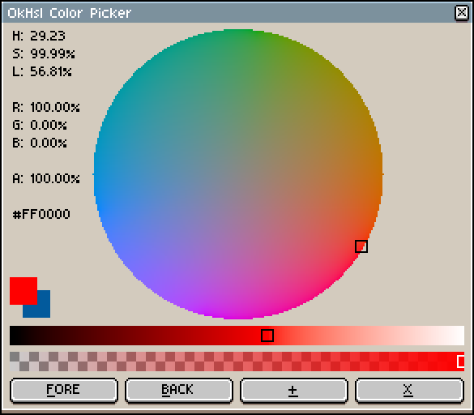

# Okhsl for Aseprite

This is a set of [Aseprite](https://www.aseprite.org/) dialogs that utilize [Okhsl](https://bottosson.github.io/posts/colorpicker/) to provide a color picker, gradient, color wheel generator and an adjustment filter.

Aseprite is an "animated sprite editor & pixel art tool." Okhsl is a color representation developed by Bjorn Ottosson to create an alternative to HSL that is based on human perception. Those looking for an interactive online comparison between Okhsl, [HSLuv](https://www.hsluv.org/) and traditional HSL should refer to this [article](https://bottosson.github.io/misc/colorpicker/).

_These scripts were tested with Aseprite version 1.3.5._

[sRGB](https://www.wikiwand.com/en/SRGB) (standard RGB) is the assumed color profile. The sprite's profile can be changed under `Sprite > Properties`. Aseprite's color management settings are under `Edit > Preferences`, in the `Color` section.

To modify these scripts, see Aseprite's [API Reference](https://github.com/aseprite/api). A [type definition](https://github.com/behreajj/aseprite-type-definition) for use with VS Code and the [Lua Language Server extension](https://github.com/LuaLS/lua-language-server) is also available.

## Installation

To install, open Aseprite, go to `File > Scripts > Open Scripts Folder`. Copy and paste the Lua scripts from this repository into that folder. Return to Aseprite. Go to `File > Scripts > Rescan Scripts Folder` (the default hotkey is `F5`). The scripts should now be listed under `File > Scripts`.

## Usage

Select `ok_picker` or `ok_hue_adj` to launch a dialog.

If an error message in Aseprite's console appears, check if the script folder is on a file path that includes characters beyond [UTF-8](https://en.wikipedia.org/wiki/UTF-8), such as 'é' (e acute) or 'ö' (o umlaut). See this [thread](https://community.aseprite.org/t/script-folder-path-cannot-open-no-such-file-or-directory/16818) for discussion of the issue on the community forum.

To assign a hotkey to a dialog go to `Edit > Keyboard Shortcuts`.
 
The underlined letters on each dialog button indicate that they work with keyboard shortcuts: `Alt+F` gets the foreground color, `Alt+B` gets the background color, `Alt+X` closes the dialog, `Alt+W` creates a wheel, `Alt+G` creates a gradient. When shading is active, `Alt+A` appends the swatches to the active palette.

Left click on a color preview window to assign the color to the foreground. Right click to assign to the background. If the alpha channel slider is zero, the color assigned will be transparent black (`0x0` or `Color(0, 0, 0, 0)`).

Hues in Okhsl are not the same as in CIE LCH, HSLuv, or traditional HSL. For example, red (`#ff0000`) has a hue of approximately 29 degrees in Okhsl. Do not assume different color representations have the same primaries, or the same spatial relationships between colors.

Beware of drift in hue and other channels when getting and setting colors. For example, getting `#ff0000` will result in (29, 255, 145) in Okhsl. However, setting the picker's sliders to those values manually will yield the hexadecimal `#ff0205`.

Saturation and lightness sliders use the integer range [0, 255], not [0, 100], to mitigate this issue. The former allows for a finer granularity. I.e., 360 * 100 * 100 = 3600000 possibilities while 360 * 255 * 255 = 23409000 possibilities.

### Color Wheel

When the `WHL` button is clicked, a new sprite is created. When saturation varies with frames on the time axis, the wheel will be white at its center and black at its circumference. The color wheel's hue is shifted by 30 degrees to match the Aseprite convention.

Click on the `Settings` toggle for `Wheel` to show more options. For example, the `Sectors` and `Rings` sliders can be used to make the color wheel discrete in a fashion similar to Aseprite's built-in color wheels. The color property that varies by frame will depend on whether the `Mode` is `HSL` or `HSV`: the choice is between `SATURATION` and `LIGHTNESS` or between `SATURATION` and `VALUE`. 

The hue can also be remapped to one of three options: RGB, RYGB and RYB.

### Gradient

The `GRD` button creates a new sprite with a horizontal gradient starting with the background color at the left and ending with the foreground color at the right. The sprite's palette is set to a number of swatches. The gradient ignores source color alpha. The gradient responds to the `Mode`, where `HSV` and `HSL` provide the hue easing options of `NEAR`, `CCW` (counter-clockwise) and `CW` (clockwise). The discontinuity between saturated blue and teal means that hue-based gradients will require adjustment.

### Harmonies

Supported harmonies are: analogous, complementary, split, square and triadic. Shading swatches are grouped under harmonies to conserve screen space.

This tool -- its harmony and shading features in particular -- is an imperfect aide to artistic judgment, not a replacement for it. See Pixel Parmesan's "[Color Theory for Pixel Artists: It's All Relative](https://pixelparmesan.com/color-theory-for-pixel-artists-its-all-relative/)" on the subject.

### Color Adjustment

A separate dialog allows for cel image adjustment with either `HSV` or `HSL`. `Alt+O` applies the adjustment, `Alt+X` cancels the dialog.

_As of Aseprite version 1.3.2, all adjustments are made in-place. Indexed and grayscale color modes are also supported. When a tile map is selected, all tiles in the tile set that the map uses will be adjusted. To make this possible, a hacky unique ID is assigned to all tile sets in the sprite._

For comparison, below is Aseprite's built-in hue adjustment:

Four colorize options are included for gray colors. `OMIT` excludes grays from saturation. `ZERO` sets the source hue to zero, which is a magenta, not red. `WARM` and `COOL` set the hue to a range between violet and yellow based on the color's lightness in OK LAB. The difference between them is the hue easing direction.

Above, the image was first de-saturated to grayscale. In the re-saturated versions, `WARM` is on the left, `ZERO` is in the center, `COOL` is on the right.

The test image is one of the first images taken by [Nasa's Webb Telescope](https://www.nasa.gov/webbfirstimages/).

## Changes

Unused methods have been removed. The original code has been modified to handle edge cases for black, white and grays. There are some measures to prevent the passing of invalid values to division or square-root.

The hue for grays is left at zero to follow convention. However, this will cause problems when, for example, creating a gradient from a gray to a saturated color or when sorting colors by hue.

## License

This repository uses the MIT License associated with the original implementation in C++ in Ottosson's article.

> Copyright(c) 2021 Bjorn Ottosson
>
> Permission is hereby granted, free of charge, to any person obtaining a copy of
> this software and associated documentation files(the "Software"), to deal in
> the Software without restriction, including without limitation the rights to
> use, copy, modify, merge, publish, distribute, sublicense, and/or sell copies
> of the Software, and to permit persons to whom the Software is furnished to do
> so, subject to the following conditions:
>
> The above copyright notice and this permission notice shall be included in all
> copies or substantial portions of the Software.
>
> THE SOFTWARE IS PROVIDED "AS IS", WITHOUT WARRANTY OF ANY KIND, EXPRESS OR
> IMPLIED, INCLUDING BUT NOT LIMITED TO THE WARRANTIES OF MERCHANTABILITY,
> FITNESS FOR A PARTICULAR PURPOSE AND NONINFRINGEMENT. IN NO EVENT SHALL THE
> AUTHORS OR COPYRIGHT HOLDERS BE LIABLE FOR ANY CLAIM, DAMAGES OR OTHER
> LIABILITY, WHETHER IN AN ACTION OF CONTRACT, TORT OR OTHERWISE, ARISING FROM,
> OUT OF OR IN CONNECTION WITH THE SOFTWARE OR THE USE OR OTHER DEALINGS IN THE
> SOFTWARE.